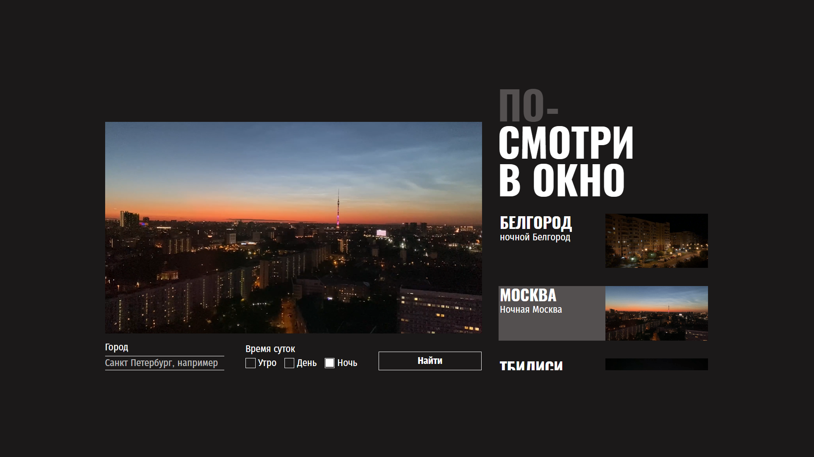

# Проект "Посмотри в окно"

Веб-приложение для поиска и просмотра видео с различных веб-камер из разных городов.

- [Автор](#автор)
- [Описание](#Описание)
- [Скриншот](#скриншот)
- [Технологии](#Технологии)
  
## Автор

Шевелев Артём

## Описание

Приложение позволяет пользователям:
- Просматривать видео из разных городов
- Фильтровать видео по времени суток (утро, день, ночь)
- Просматривать видео в высоком качестве
- Навигировать по карточкам с дополнительной информацией

## Технологии

- **HTML5** - семантическая разметка
- **CSS3** - современные стили с логическими свойствами
- **JavaScript** - интерактивность и работа с API
- **Flexbox/Grid** - адаптивная верстка

## Cкриншот

